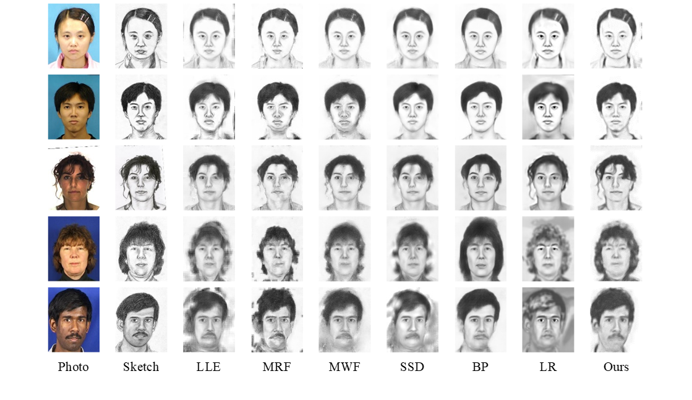
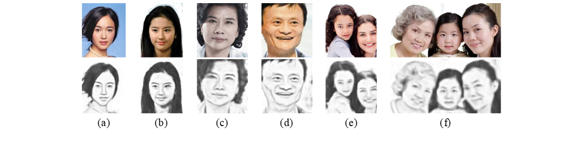

# ANS-GDA For Face Photo-Sketch Synthesis


Example-based face sketch synthesis technology generally requires face photo-sketch images with **face alignment and size normalize**. To break through the limitation, we propose Anchored Neighborhoods Search(ANS) Based on Global Dictionary Atoms(GDA) for Face Photo-Sketch Synthesis.

If you use this code for your research, please cite our papers.

```
@inproceedings{
  title={Anchored Neighborhoods Search Based on Global Dictionary Atoms for Face Photo-Sketch Synthesis},
  author={Feng Liu，Ran Xu, Jieying Zheng, Qiuli Lin, Zongliang Gan},
  booktitle={The 11th International Conference on Digital Image Processing(ICDIP)},
  year={2019}
}
```

## Paper
Feng Liu，Ran Xu, Jieying Zheng, Qiuli Lin, Zongliang Gan,Anchored Neighborhoods Search Based on Global Dictionary Atoms for Face Photo-Sketch Synthesis,The 11th International Conference on Digital Image Processing(ICDIP),2019.

## Dataset

- CUHK Face Sketch Database (CUFS):  [Download from here.](http://mmlab.ie.cuhk.edu.hk/archive/facesketch.html)

    - AR
    - CUHK Students
    - XM2VTS

## Result

For **aligned face photos:**



For the **real-world photos:**




## Run

The main file is "./Code/photo2sketch.m".

For training, it reads the training photos and training sketch. 

For testing, it reads the original face photos and outputs the synthesized sketches.

Developing and testing environment: MatLab R2018a.


